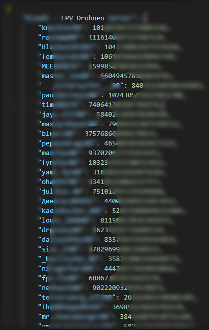

 

  

  <h3 align="center">Discord Tools</h3>

  

    Be aware that Using selfbots on Discord is strictly prohibited and can result in a ban.
     
     
    <a href="https://github.com/knechter-maker/discord-scraper-tools/issues">Report Bug</a>
    .
  

  

## About The Project

The "Discord Server User Collector" is a Python script built using the Discord.py library, designed to help server administrators easily collect a list of users and their IDs from a specific Discord server. This project can be particularly useful for server management, data analysis, or user tracking purposes.

User Data Collection: The script connects to a Discord server using a bot account and gathers information about all the users within the specified server.

User-Friendly Setup: The project utilizes a configuration file (config.json) to store the bot token, making it easy for users to set up and run the script with minimal effort.

Customization: The script allows you to specify the target server by providing its server ID as a command-line argument, making it flexible and adaptable for different server contexts.

Data Export: The collected user data is saved in a JSON file (server_users.json) in a structured format, which can be easily accessed and analyzed as needed.

## Usage

python userlistscraper.py <SERVER_ID>

## Roadmap

See the [open issues](https://github.com/knechter-maker/discord-scraper-tools/issues) for a list of proposed features (and known issues).

## Contributing

Contributions are what make the open source community such an amazing place to be learn, inspire, and create. Any contributions you make are **greatly appreciated**.
* If you have suggestions for adding or removing projects, feel free to [open an issue](https://github.com/knechter-maker/discord-scraper-tools/issues/new) to discuss it, or directly create a pull request.

### Creating A Pull Request

1. Fork the Project
2. Create your Feature Branch (`git checkout -b feature/AmazingFeature`)
3. Commit your Changes (`git commit -m 'Add some AmazingFeature'`)
4. Push to the Branch (`git push origin feature/AmazingFeature`)
5. Open a Pull Request

## Authors

 knechter -  - [knechter](https://github.com/knechter-maker) - **

